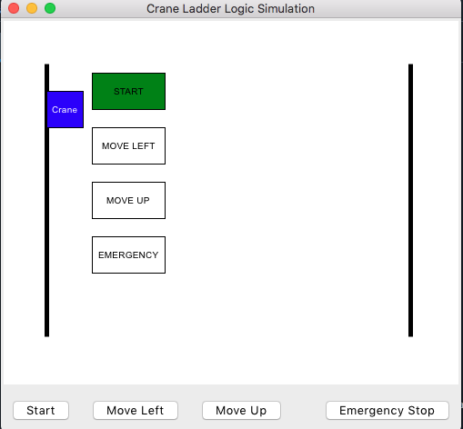
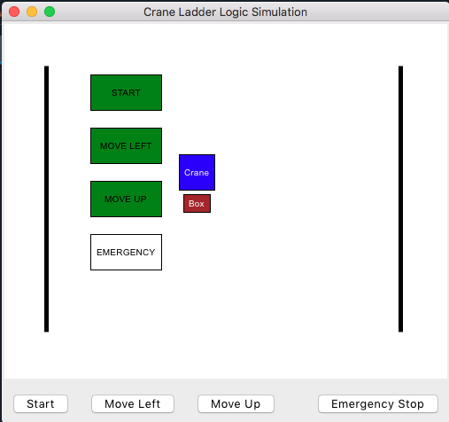
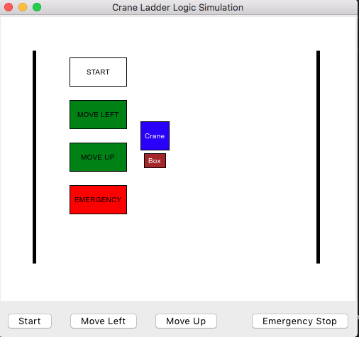

# Crane-Ladder-Logic-Simulation

This project simulates PLC-style ladder logic for a crane operation using Tkinter in Python. It visually represents ladder rungs, simulates crane movement, and includes essential control buttons like Start, Move Left (Lower), Move Up, and Emergency Stop.

## Features
✅ Ladder Logic Visualization – Rungs light up when active

✅ Smooth Crane Animation – Moves left/down to pick an object, then up to return

✅ Emergency Stop & Latching Circuit – Stops operations and resumes when started again

✅ Stacked Layout – Ladder logic above, crane animation middle, buttons below

## Installation & Running
1. Clone the Repo
   
git clone https://github.com/YOUR-USERNAME/Crane-Ladder-Logic.git

cd Crane-Ladder-Logic

2. Run the Simulation
   
Make sure you have Python installed, then run:

python crane_simulator.py

## Dependencies
This script runs on Tkinter, which comes pre-installed with Python. No extra dependencies required!

## Future Improvements
Smooth Reanimation using after()

More Crane Movements (e.g., sideways motion)
